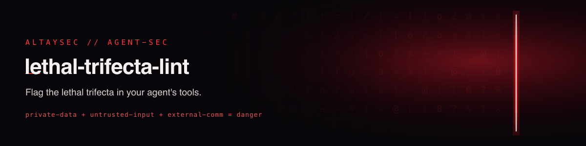

# lethal-trifecta-lint

**Does your AI agent hold all three keys to a data breach at once?**

The **lethal trifecta** — a term coined by [Simon Willison](https://simonwillison.net/2025/Jun/16/the-lethal-trifecta/)
— is the observation that an AI agent becomes dangerous exactly when it can do three things at once:

1. 🔒 **access private data**,
2. 🌐 **ingest untrusted content** (which may carry injected instructions), and
3. 📤 **communicate externally**.

Any one alone is fine. All three together means a prompt injection hidden in the untrusted content
can tell the agent to read your private data and send it out — and it has every tool it needs to
comply. `lethal-trifecta-lint` reads your agent's **tool manifest**, classifies each tool by which
of the three capabilities it grants, and fails your build if the trifecta is present.

Zero dependencies. Works on **MCP `tools/list`**, **OpenAI/Anthropic tool schemas**, **LangChain
exports**, or a plain list of tool names.

[](LICENSE)
[](tests/)
[](ltlint/)

---

## 🚀 Quickstart

```bash
python -m ltlint.cli examples/trifecta_agent.json
```

```
🛑 lethal-trifecta-lint — 3 tool(s)
  🔒··  read_file
  ·🌐📤  fetch_url
  ··📤  send_email
  legend: 🔒 private-data  🌐 untrusted-intake  📤 external-comm

  🛑 LETHAL TRIFECTA PRESENT
     • 'read_file' reads private data and 'send_email' can send it out,
       while the agent also ingests untrusted content
  Fixes: remove one leg of the trifecta — drop the egress tool, sandbox the
     data source, or gate untrusted input behind human review / an allow-list.
```

Exit code is **2** when the trifecta is present (and 0 otherwise), so it gates CI directly.
Add `--warn-exit` to also fail on a two-of-three warning, `--json out.json` for machine output.

## 🧩 Supported manifest formats (auto-detected)

| Format | Shape |
|--------|-------|
| MCP `tools/list` | `{"tools":[{"name","description","inputSchema":{"properties":…}}]}` |
| OpenAI / Anthropic | `[{"type":"function","function":{"name","description","parameters":…}}]` |
| LangChain export | `[{"name","description","args_schema":…}]` |
| Plain name list | `["read_file","send_email",…]` |

Export your live tools to one of these and pipe it in — e.g. dump an MCP server's `tools/list`
response, or `json.dumps([t.dict() for t in tools])` from a LangChain agent.

## 🔍 How classification works

Each tool is tagged from its **name, description, and parameter names** using explicit, auditable
keyword sets (see [`ltlint/classify.py`](ltlint/classify.py)). A tool can hold more than one
capability — an email reader both accesses private mail (🔒) and ingests untrusted content (🌐); a
`fetch_url` both pulls untrusted content (🌐) and can smuggle data out in a query string (📤).

The linter then reports:

- **Single-tool trifecta** — one tool that alone holds all three (the most dangerous).
- **Trifecta across tools** — the agent's *combined* toolset covers all three capabilities.
- **Toxic exfil pairs** — a private-data tool + an egress tool, while untrusted intake exists.

## 🧰 Use it in CI

```yaml
# .github/workflows/agent-safety.yml
name: agent-safety
on: [pull_request]
jobs:
  trifecta:
    runs-on: ubuntu-latest
    steps:
      - uses: actions/checkout@v4
      - uses: actions/setup-python@v5
        with: { python-version: "3.11" }
      - uses: fevziegeyurtsevenler/lethal-trifecta-lint@main
        with:
          manifest: agent_tools.json     # path in YOUR repo; add warn-exit: "true" to fail on 2-of-3
```

<details><summary>Or without the action (clone + run)</summary>

```yaml
      - run: |
          git clone --depth 1 https://github.com/fevziegeyurtsevenler/lethal-trifecta-lint
          PYTHONPATH=lethal-trifecta-lint python -m ltlint.cli agent_tools.json
```
</details>

## ⚖️ Honesty & limits

- **A heuristic, not a proof.** Classification is keyword/schema based: it can mis-tag an unusually
  named tool and can't see what a tool *actually* does at runtime. Treat findings as a prompt to
  review, and extend the keyword seeds for your stack.
- **Design signal, not a runtime guardrail.** A clean result means the *declared capabilities* don't
  form the trifecta; it does not sandbox anything. Pair it with least-privilege tools, egress
  allow-lists, and human-in-the-loop for irreversible actions.
- The concept is **Simon Willison's**; this tool just makes it lintable. Credit to him.

## 🔗 Related AltaySec work

- 🕵️ [uncloak](https://github.com/fevziegeyurtsevenler/uncloak) — hidden/invisible-Unicode prompt-injection scanner
- 🏁 [guardrail-arena](https://github.com/fevziegeyurtsevenler/guardrail-arena) — two-axis multilingual guardrail benchmark
- 📦 [hf-dataset-scan](https://github.com/fevziegeyurtsevenler/hf-dataset-scan) — scan datasets for smuggled injection
- 🌐 [AltaySec](https://altaysec.com.tr) · [Açık Kaynak Lab](https://altaysec.com.tr/acik-kaynak)

## Citation

```bibtex
@misc{yurtsevenler2026lethaltrifectalint,
  title  = {lethal-trifecta-lint: Linting AI Agent Tool Manifests for the Lethal Trifecta},
  author = {Yurtsevenler, Fevzi Ege},
  year   = {2026}, publisher = {AltaySec},
  howpublished = {\url{https://github.com/fevziegeyurtsevenler/lethal-trifecta-lint}},
  note   = {Concept: Simon Willison, "The lethal trifecta for AI agents" (2025)}
}
```

Apache-2.0 · built by **[AltaySec](https://altaysec.com.tr)** — Türkçe-first AI/LLM security.

---

## İlgili AltaySec Kaynakları

- 📖 [Lethal Trifecta (Ölümcül Üçlü) Nedir? Ajanlarda Veri Sızdırmanın Üç Koşulu](https://altaysec.com.tr/arastirmalar/lethal-trifecta-olumcul-uclu-ajan) — konunun derinlemesine Türkçe analizi
- 🌐 [AltaySec Araştırmalar](https://altaysec.com.tr/arastirmalar/) — Türkçe yapay zekâ güvenliği yazıları
